<!-- templeOs -->

  

<!-- Terminal como descripción/intro, ancho completo -->

  

<!-- Metrics + Topics en dos columnas -->
<table>
  <tr>
    <td width="65%" valign="top">
      
    </td>
    <td width="35%" valign="top">
      
    </td>
  </tr>
</table>

  

