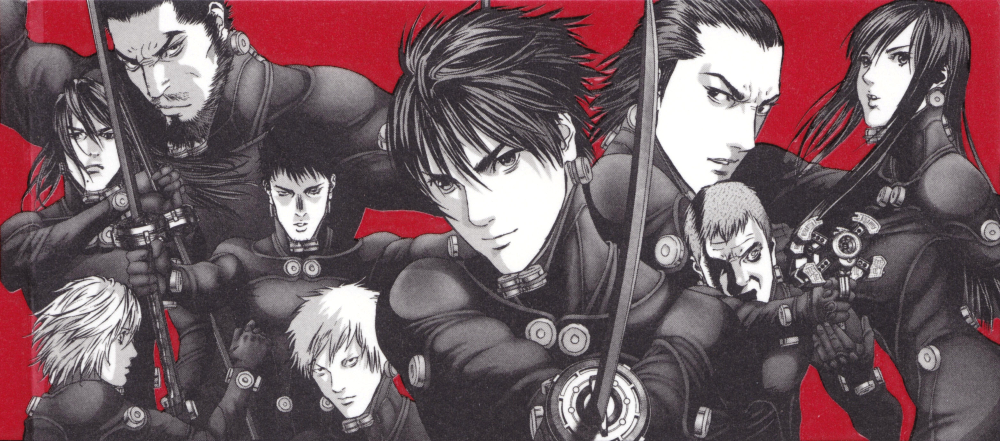

  

<table width="100%">
  <tr>
    <td width="60%" valign="top">
      
    </td>
    <td width="40%" valign="top">
      
        
      
         
      
        
      
        
      
    </td>
  </tr>
</table>
<!-- Banner de manga al final -->

  

<!-- 

 --  

 -->
